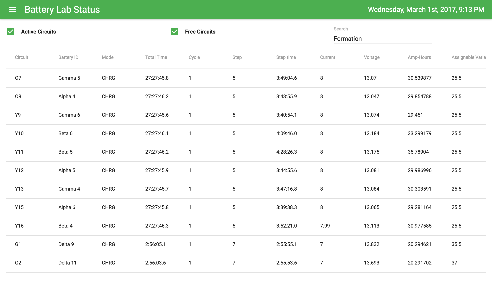

# Battery Lab Status

Single-page app built with React and javascript to live stream battery lab electrical and environmental data using REST. Bitrode data is fed in through fetching an html log file, environmental data is fetched from PostgREST. Data is automatically refreshed every 5 minutes.

## Install
Using npm, you can install and run a dev server using:

```
$ npm install
$ npm start
```
And you can create a production build using:

```
$ npm run build
```
Details for each module's functionality can be found in the source code headers.

## Dashboard


The dashboard features four panels, which depend on the grouping options in the menu.

### Group By Test

This view is the default, and features:

* Alarms and Faults: Shows hydrogen alarms, AC vent status, water sensor trips, pumps that are not running, and Bitrode circuits that have thrown a fault.
* Real-time Analysis: Plots the last 25 records for the current test, colored by battery type. Voltage is usually plotted, but current is plotted instead if the voltage variance is particularly low.
* Test Cycles: Number of cycles each circuit has completed for the current test. Tests are rotated through being displayed every 6 seconds.
* Test Mode: Fraction of test circuits that are in each mode. Tests are rotated through being displayed every 6 seconds.

### Group By Bitrode

This view shifts focus from testing to equipment, and features:

* Alarms and Faults: Shows hydrogen alarms, AC vent status, water sensor trips, pumps that are not running, and Bitrode circuits that have thrown a fault.
* Bath temperature: Temperature readings in the 10 baths. Bars are blue for heaters that are not running and red for heaters that are running.
* Bitrode Cycles: Number of cycles each circuit has completed for the current Bitrode. Bitrodes are rotated through being displayed every 6 seconds.
* Bitrode Mode: Fraction of Bitrode circuits that are in each mode. Bitrodes are rotated through being displayed every 6 seconds.

## Tabular Overview



Shows all raw data for the Bitrodes. Table can be searched and filtered. The two toggle switches at the top of the page can hide free or active circuits. Currently unreadable on mobile.

## Cycling Progress


Number of cycles each circuit has completed, sorted by Bitrode or test. The color of the bar refers to the mode that the circuit is in.

## Battery Temperature
Temperature of the thermocouple connected to each circuit, sorted by Bitrode or test.

## Water Baths
Current temperature readings in the 9 baths, as well as an interface for plotting sensor history. Can choose a timeframe and plot bath temperature, heater status, pump status, H2 alarms, or water overflow alarms versus time. Data is polled every 5 minutes.

## Real-time Analysis


Interface for plotting battery voltage, current, capacity, step, cycle, and temperature. If grouping by Test, the battery type will be derived and all batteries of the same type will be plotted with the same color. Individual batteries within that type are assigned a linetype in order to better differentiate them. Data is polled every 5 minutes.

Deeper statistical analysis is unlikely using this interface due to resolution limitations.
